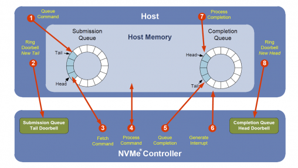
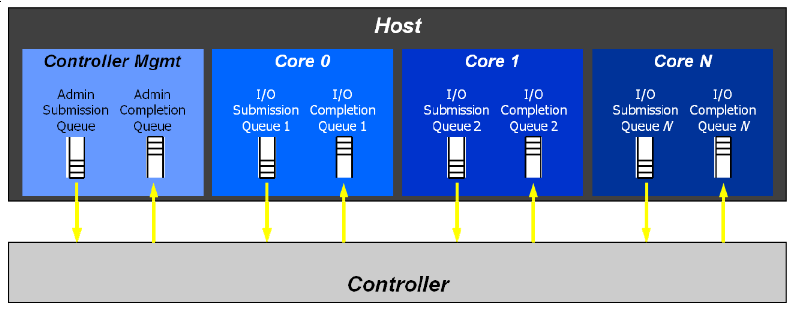
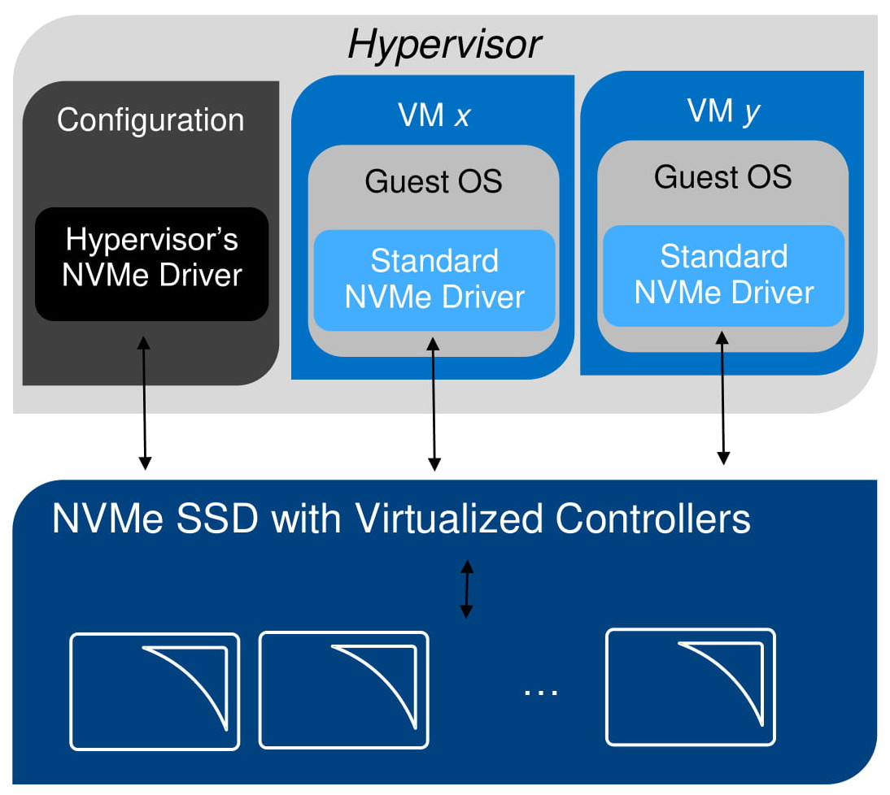

NVMe is the new SCSI. Why is it here, how it works ? How can we do NVMe
passthrough without SR-IOV ?

What is NVMe ?
=====

NVMe stands for NVM Express (NVM stands for non-volatile memory). NVMe aims to
address the needs of Enterprise and Consumers by being scalable and flexible.
It is designed from the ground up to take advantage of flash storage
properties unlike the SCSI or AHCI protocols.

Historically, for block devices we had two main choices of interfaces and
protocols:

 - SATA interface with AHCI/ATA
 - SAS (Serial Attached SCSI) with SCSI

These old buses along with the protocols they are associated to were designed
with mechanical hard drives in mind, thus, while suitable for use along with
mechanical hard drives, they present some major limitations when used along
with flash storage.

For example SATA has those limitations:

 - Upper transfer limit of 600 MB/s
 - Uses the AHCI standard
    Not designed with flash storage in mind (Optimized for slow read/write and
    not much concurent access)

Flash storage used in SSD are now capable of speeds exceeding 600 MB/s and
capable of accessing lots of data at once. NVMe takes advantage of those
capabilities and enables greater throughput and less latency by utilizing the
PCIe buses. It parallelize instructions to a greater extend than the SATA and SAS
buses did.

\newpage

How it works ?
==============

Command queueing defines the amount of data a drive can handle at one time.
AHCI can handle 1 queue with a maximum of 32 commands, by comparison NVMe
allows up to 64K queues with a maximum of 64K commands.

An I/O Command Set (called NVM Command Set) is used with an I/O queue pair.
Each I/O queue pair is made of a submission queue and a completion queue.

The host software creates queues, the number of queues created is dependant of
the anticipated workload and of the system configuration. For example it is
possible to associate a queue per cpu core in order eliminate the need for
synchronization when submitting commands.

There are two types of commands:

 - Admin Commands
 - I/O Commands (called NVM Commands)

There are two types of queues:

 - The Submission Queues (SQ) are circular buffers used by the host to give
 commands to the controller.  The controller then fetches entries located in
 the submission queues, each entry is a command.

 - The Completion  Queues  (CQ) are circular buffers used by the controller to  post  status  for  completed 
commands. There can be multiple Submission Queues associated with a Completion
Queue.

\newpage

Admin  Submission  and  Admin Completion  Queue  exist  in order to manage and control the device. For instance,  for the  creation and deletion of Submission and Completion Queues and aborting commands. Only admin commands (That are part of the Admin Command Set) are to be sent to the Admin Submission  Queue. 

\vspace{3mm}

The NVMe queues follow a Producer/Consumer model:

 - The host acts as the producer of commands and updates the submission queue tail
 pointer, it also acts as the consumer of completions and updates the completion queue head pointer

 - The controller acts as the consumer of commands and update the submission queue head
 pointer, it also acts as the producer of completions and updates the completion queue tail pointer

The processing of an NVMe I/O Command takes place as follows:

 1. The host inserts a new command and updates the submission queue tail pointer
 2. The device is notified of the change via the Submission Queue hardware doorbell register
 3. The controller consumes the command and update the submission queue head pointer
 4. The command is processed
 5. A completion entry is added to the completion queue
 6. The controller generates an interrupt
 7. The host consumes the completion entry
 8. The device is notified of the change via the Completion Queue hardware doorbell register

\newpage

\newpage

Passthrough using SR-IOV
======

NVMe passthrough can be achieved using SR-IOV. SR-IOV (single root input/output
virtualisation) is an extension of the PCIe specification. It allows a PCIe
device to expose its resources through PCIe hardware functions. It allows also
different virtual machines to share a single PCIe hardware interface.

 - There is a PCIe Physical Function (PF), which is the primary function of the
 device and also discloses the device's SR-IOV capabilities.

 - There are also one or more PCIe Virtual Functions (VFs), which shares some
 physical resources of the device. Theses are what interest us in the context
 of NVMe passthrough. Indeed, thanks to these PCIe Virtual Functions, it is
 possible to reduce the overhead associated with virtualisation by giving
 access to these to the guest.

In the version 1.3 of the NVMe specification released Q2 of 2017, some
virtualisation features where added.

NVMe has now a way to map virtualised NVMe controllers to different physical
and virtual functions and intelligently provision resources between virtual
functions.
  
\newpage

\newpage

